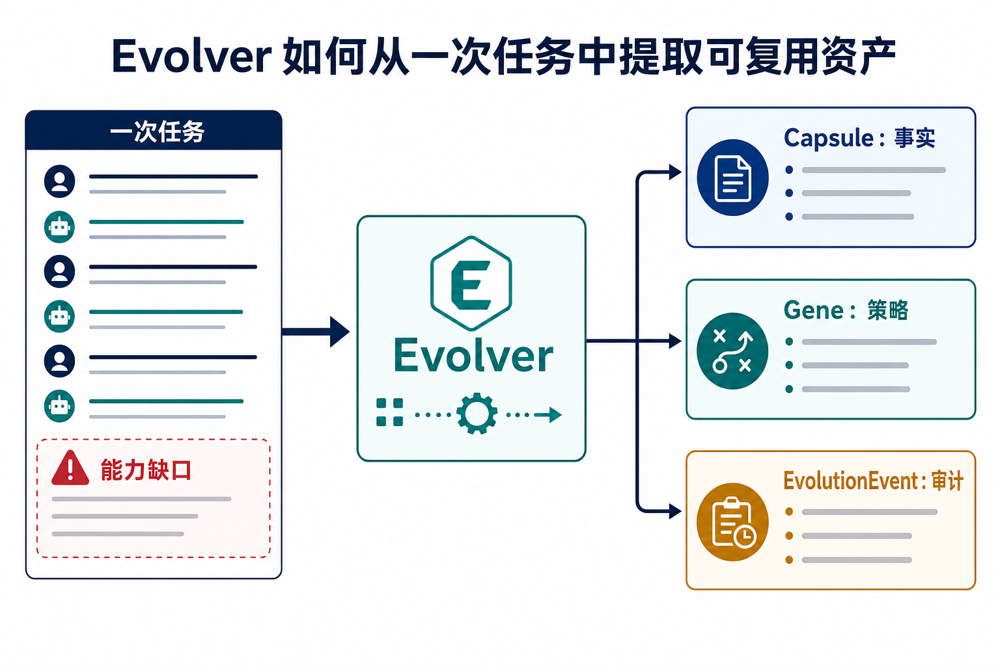

# Evolver 演示 Case：同一需求下，Agent 从绕弯到直达方案

> 这份文档的目标不是介绍一个复杂项目，而是完成一个演示任务：证明同一个 coding-agent 需求，普通 Agent 容易反问、纠结或绕弯；接入 EvoMap / Evolver 后，Agent 能先复用进化资产，再直接给出方案。

飞书版本：<https://ccnjn62goe9e.feishu.cn/docx/B9qrd6h7aomI33x2gQocuB88nKJ>

## 1. 先给观众看结果

演示的第一张图就要说明差异：同一句需求，Agent 的起手式不同。


普通 Agent 面对数据库、OSS、服务器、视频流水线这些上下文时，会先停下来确认。Evolver 后的 Agent 会先拿到事实资产和策略资产，再生成 `asset_manifest + Resolver` 方案。

这就是演示要证明的核心：

- 普通 Agent：先问“你这套系统是什么？”
- Evolver Agent：先 recall“我已经知道这套系统”，再进入方案。

## 2. 固定使用同一句需求

演示时不要换 prompt，就用这一句：

```text
我要给 N5 单词卡生成一批音频和插图，上传到 OSS，并让网站、两个 app、视频剪辑流水线都能复用。国内用户走国内 OSS/CDN，海外用户走海外加速。你帮我设计并落地最小实现。
```

这个需求足够小，可以讲清楚；也足够复杂，能触发普通 Agent 的典型问题：


它会合理地反问：

- 服务器怎么分工？
- OSS 怎么配置？
- 数据库结构是什么？
- 视频流水线读哪里？
- URL 到底存数据库还是运行时生成？

这些问题本身没错。问题是：如果这些信息之前已经在任务里反复出现过，Agent 还每次从零问，就说明它没有形成可复用能力。

## 3. 把场景压到最小

这个 case 不需要讲完所有真实业务，只保留最小可复现拓扑。


最小场景只有四条业务线和四个基础设施别名：

| 类型 | 最小元素 |
| --- | --- |
| 业务线 | 网站、语音练习 App、语法助手 App、视频流水线 |
| 基础设施 | `db-primary`、`oss-cn-assets`、`server-cn-app`、`server-global-edge` |
| 共享资产 | 单词、语法、音频、插图、视频素材 |
| 历史策略 | 数据库存 `object_key`，URL 由 resolver 按区域生成 |

这个最小模型已经足够复现老板要的三类现象：

1. Agent 不知道上下文，解决不了或只能给泛泛方案。
2. Agent 反问用户，需要用户重复确认。
3. Agent 在多个方案之间纠结：存完整 URL、同步 OSS、反向代理、视频流水线单独数据源等。

## 4. Evolver 后的 Agent 怎么直达方案

接入 Evolver 后，Agent 的路径变短：


它不是“不问任何问题”，而是只问真正需要确认的高风险动作。具体表现是：

1. 收到需求后判断这是 substantive 任务。
2. 先 recall。
3. 命中 Capsule / Gene。
4. 直接生成最小方案。
5. 只确认写数据库 migration、真实上传 OSS 这类动作。

最终方案应该长这样：

- 建 `asset_manifest`，作为 web / app / video 共用事实源。
- OSS 上传后写入 `object_key`、`sha256`、`asset_type`、`word_id`、`locale`、`status`。
- 数据库不存固定完整 URL。
- 用 `AssetUrlResolver(region, object_key)` 生成国内 / 海外访问地址。
- 国内走 OSS/CDN，海外走 `server-global-edge`。

## 5. 为什么 Evolver 能让行为变化

这部分放在效果之后讲，不要一开始就讲概念。



Evolver 从一次任务中提取三类东西：

| 资产 | 这次 case 中的含义 |
| --- | --- |
| Capsule：事实 | 我的项目拓扑、服务器别名、OSS 和数据库关系 |
| Gene：策略 | 共享素材发布策略，尤其是 `asset_manifest + object_key + AssetUrlResolver` |
| EvolutionEvent：审计 | 这次能力缺口、采用策略和结果是否有效 |

再放一张闭环图说明这不是一次性 prompt，而是自进化循环：


重点句：

> Evolver 不是让 Agent 背更多 prompt，而是让 Agent 把一次任务里的有效经验，变成下一次任务开始前可召回的能力资产。

## 6. 怎么验证不是概念

开源 repo 里有一个离线 demo，用来稳定复现行为差异。


运行：

```bash
git clone https://github.com/owenshen0907/evomap-agent-memory-demo.git
cd evomap-agent-memory-demo
python3 demo.py
python3 -m unittest discover
```

验收标准：

- 输出包含 `WITHOUT_EVOMAP`。
- 输出包含 `WITH_EVOMAP`。
- 普通路径会出现基础设施反问。
- 进化路径会出现 `asset_manifest` 和 `AssetUrlResolver`。
- 单测输出 `2 tests OK`。


这份 demo 只证明一个核心差异：进化前后，Agent 的起点不同。

## 7. 最后再讲接入方式

等观众看到效果和证据后，再讲怎么接。


通用接入分三层：

- Agent Hooks：接入 Cursor / Codex / Claude Code 的任务生命周期。
- GEP MCP：提供 recall / evolve / record。
- EvoMap Hub：可选，用于共享、发布、市场和 credits。

第一次演示建议本地优先：

```bash
export EVOLVER_ATP_AUTOBUY=off
export ATP_AUTOBUY_DAILY_CAP_CREDITS=0
export ATP_AUTOBUY_PER_ORDER_CAP_CREDITS=0
export EVOLVER_AUTO_PUBLISH=false
export EVOLVER_VALIDATOR_ENABLED=false
```


可以沉淀的是项目别名、拓扑关系、策略规则和验证结果。不能沉淀的是密钥、真实 IP、数据库密码和 signed URL。

## 8. 演示时一句话收束

> 这个 case 要证明的不是 Agent 永远不需要问问题，而是：当上下文和策略已经被 Evolver 进化成资产后，Agent 不应该再重复绕弯；它应该直接站在上一次经验之上行动。
