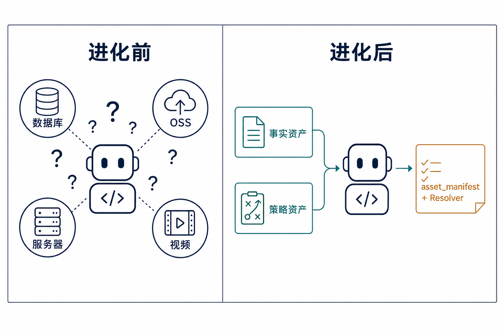
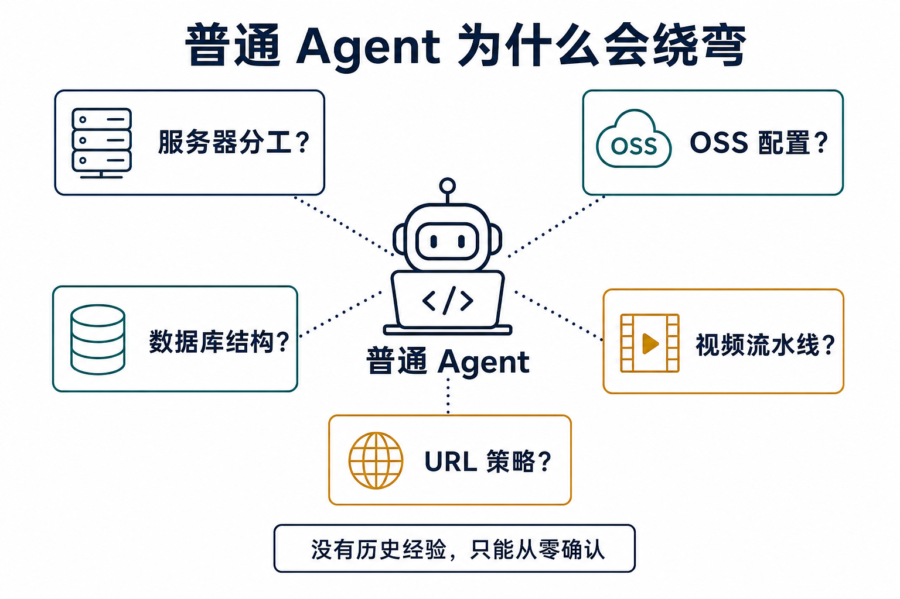
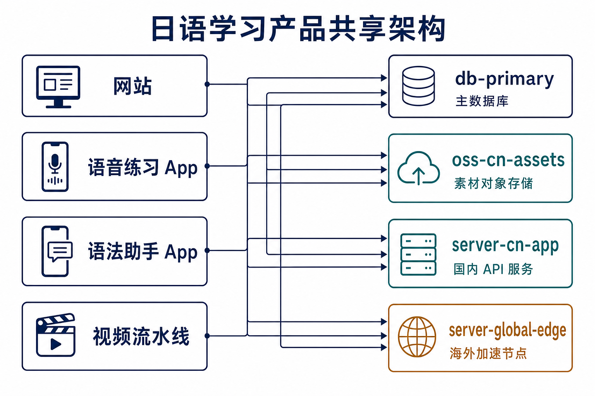
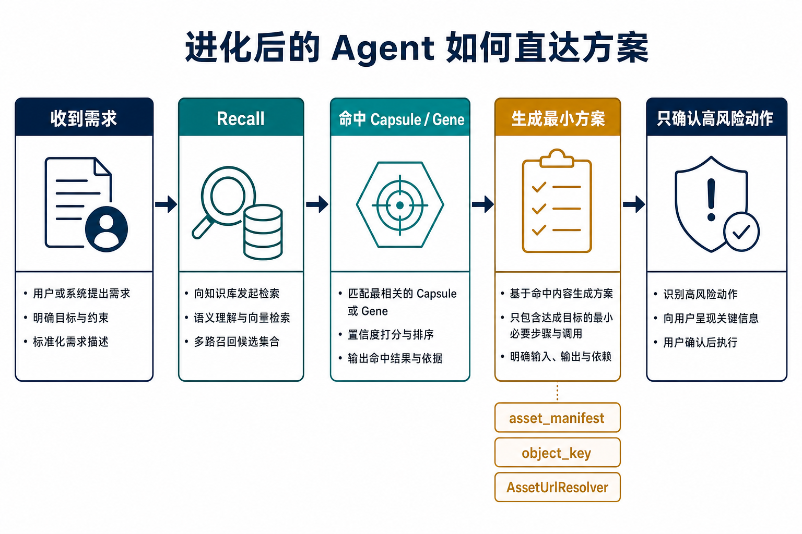
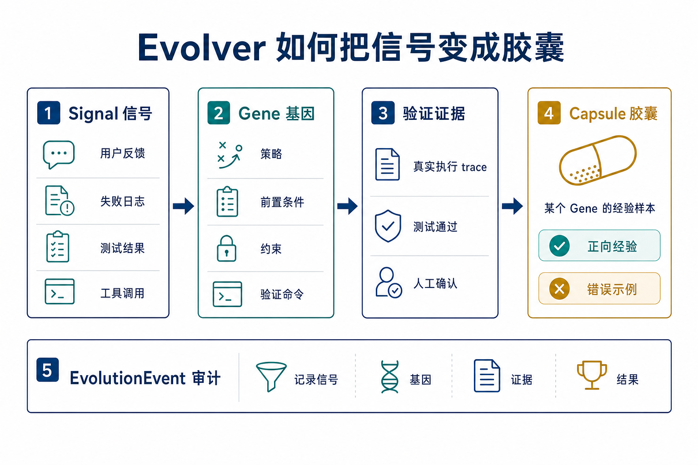
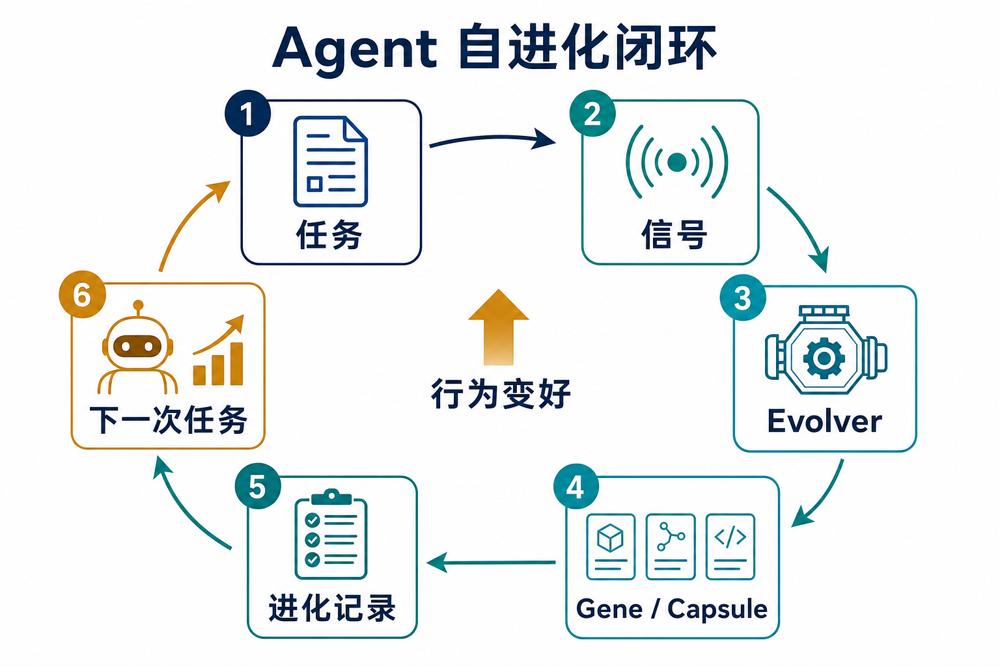
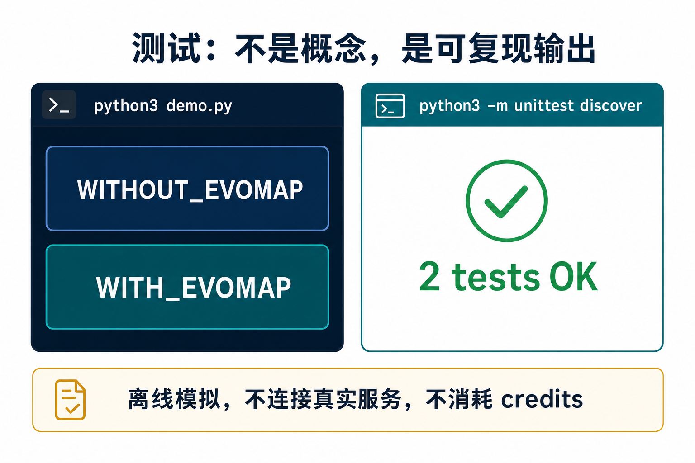
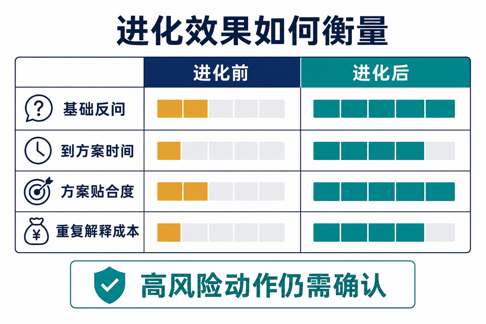
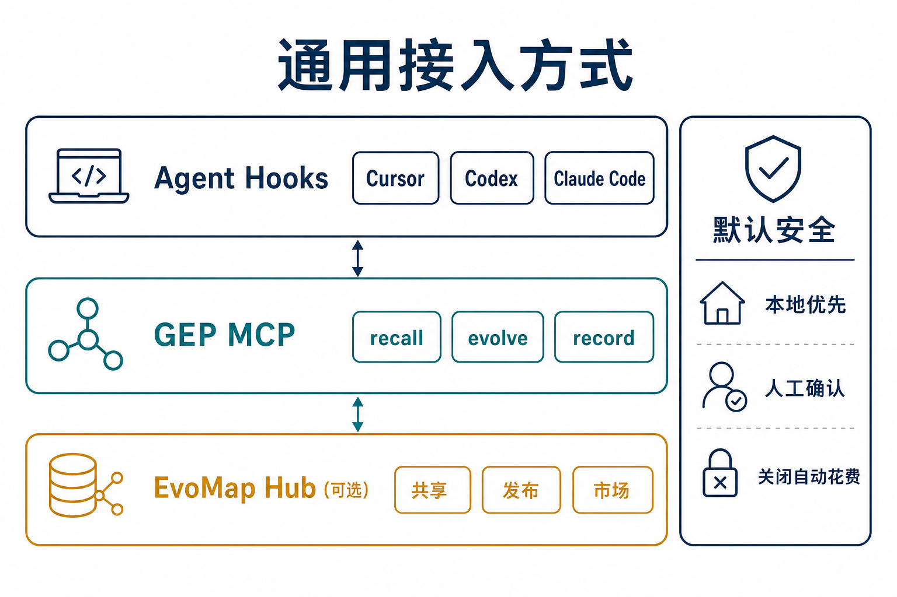
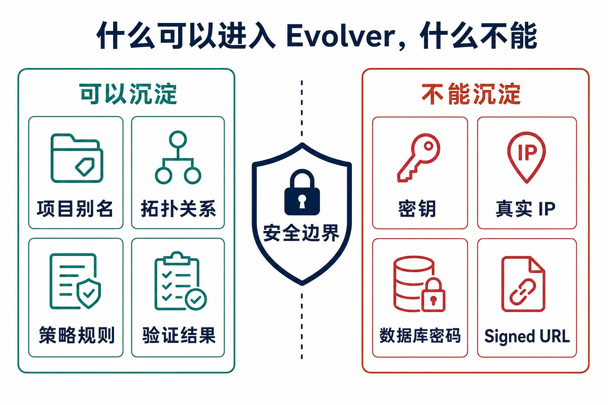

# 让 Coding Agent 从绕弯到直达方案：一个 Evolver 自进化案例

> 本文要完成一个具体验证：同一句 coding-agent 需求，普通 Agent 容易反问、纠结或只能给泛泛方案；接入 EvoMap / Evolver 后，Agent 可以先复用已经验证过的进化资产，再直接给出可落地方案。

飞书版本：<https://ccnjn62goe9e.feishu.cn/docx/B9qrd6h7aomI33x2gQocuB88nKJ>

开源 Demo：<https://github.com/owenshen0907/evomap-agent-memory-demo>

## 1. 先看事实：同一句需求，起手式不同



这类问题的核心差异，不在于模型是否更“聪明”，而在于 Agent 开始回答前有没有可召回的经验资产。

同一句需求下，普通 Agent 的第一反应通常是补上下文：服务器怎么分工、OSS 怎么配置、数据库结构是什么、视频流水线读哪里。Evolver Agent 的第一步则是 recall：先取回已经沉淀过的拓扑、约束和策略，再基于这些资产组织方案。

这篇文章要证明的不是“Agent 永远不需要问问题”，而是：当上下文、策略和验证结果已经被 Evolver 沉淀成资产后，Agent 不应该每次从零开始绕弯。

## 2. 固定问题：把真实复杂度压成一句需求

本文只使用一个最小化需求：

```text
我要给 N5 单词卡生成一批音频和插图，上传到 OSS，并让网站、两个 app、视频剪辑流水线都能复用。国内用户走国内 OSS/CDN，海外用户走海外加速。你帮我设计并落地最小实现。
```

这个需求足够小，可以稳定复现；也足够复杂，会触发普通 Agent 的典型不确定性。



普通 Agent 的反问并不是错误。它缺少的是可复用的项目记忆和经过验证的策略。因此它会合理地停在这些问题上：

- 海内外服务器分别承担什么职责？
- OSS 桶、CDN、海外加速之间是什么关系？
- 数据库应该存完整 URL，还是只存对象 key？
- 网站、两个 app、视频剪辑流水线是否共用同一份素材事实源？
- 一旦 CDN 域名、海外加速入口或 OSS 供应商变化，历史素材如何迁移？

如果这些信息此前已经在多个任务里反复出现，Agent 仍然每次要求用户重新说明，就说明它没有形成自进化能力。

## 3. 最小场景：四条业务线共用一套素材基础设施



真实项目可以很复杂，但用于验证的场景只需要保留四条业务线和四个基础设施别名。

| 类型 | 最小元素 |
| --- | --- |
| 业务线 | 日语学习工坊网站、对话语音练习 App、单词语法查询助手 App、视频短片流水线 |
| 基础设施 | `db-primary`、`oss-cn-assets`、`server-cn-app`、`server-global-edge` |
| 共享资产 | 单词、语法、音频、插图、视频素材 |
| 历史策略 | 数据库存 `object_key`，URL 由 resolver 按区域生成 |

这个最小模型足够覆盖目标要求里的三类问题：

1. 普通 Agent 缺少上下文，解决不了或只能给泛泛方案。
2. 普通 Agent 反问用户，让用户重复确认已知信息。
3. 普通 Agent 在存完整 URL、同步 OSS、反向代理、视频流水线独立数据源等方案之间来回摇摆。

## 4. Evolver Agent 应该直达什么方案



接入 Evolver 后，Agent 的路径应该变短，而不是变得更神秘。它仍然要说明假设，也仍然要在高风险动作前确认；变化在于它不再把已知上下文当成未知问题。

一个合格的直接方案应该包含这些判断：

- 建立 `asset_manifest`，作为网站、两个 app、视频流水线共用的素材事实源。
- OSS 上传后写入 `object_key`、`sha256`、`asset_type`、`word_id`、`locale`、`status`。
- 数据库不保存固定完整 URL，避免 CDN 域名、海外加速入口或供应商变化时污染历史数据。
- 用 `AssetUrlResolver(region, object_key)` 在运行时生成国内或海外访问地址。
- 国内访问走 `oss-cn-assets` / 国内 CDN；海外访问走 `server-global-edge` 或海外加速入口。
- 视频流水线读取同一份 `asset_manifest`，必要时生成带版本号的 manifest snapshot，保证剪辑可复现。

这就是本 case 要呈现的效果：同一句需求下，普通 Agent 把问题拆成一串待确认事项；Evolver Agent 先命中已有策略，再把回答推进到最小实现。

## 5. Evolver 的工作链路：Signal -> Gene -> Evidence -> Capsule



Evolver 不是简单地把项目资料塞进 prompt。更准确的工作链路是：

| 环节 | 含义 | 在本文 case 中的例子 |
| --- | --- | --- |
| Signal | 从用户反馈、失败日志、测试结果、工具调用和会话结尾中识别信号 | Agent 多次反问同一套服务器、OSS、数据库上下文；或在 URL 存储策略上反复摇摆 |
| Gene | 从信号和历史任务中提炼出的策略基因 | “共享素材发布应使用 `asset_manifest + object_key + AssetUrlResolver`” |
| Evidence | 对 Gene 的验证证据 | 离线 demo 输出、单测通过、真实执行 trace、人工确认记录 |
| Capsule | 某个 Gene 的经验样本，可以是正向经验，也可以是错误示例 | 正向经验：该策略让 Agent 直接给出可落地方案；错误示例：存完整 URL 导致后续 CDN 或海外入口迁移困难 |
| EvolutionEvent | 审计记录 | 记录触发信号、命中的 Gene、验证结果、是否形成 Capsule |

这里需要特别区分 Gene 和 Capsule。

Gene 是可复用策略，包含触发条件、前置条件、约束、执行策略和验证方式。它更像“遇到这类问题时应如何处理”的策略基因。

Capsule 不是“事实资料”的同义词。Capsule 是某个 Gene 在一次具体环境中的验证结果：可以是成功经验，也可以是失败样本。它应该带有触发场景、执行摘要、影响范围、置信度、环境信息和验证证据。没有证据的成功 Capsule 不应该被沉淀。

因此，在这个案例里，项目拓扑、服务器别名、OSS 和数据库关系可以成为 Capsule 的触发环境或内容摘要；真正值得复用的是：某个共享素材 Gene 在该环境下被验证有效，或者某个错误做法在该环境下被证明会带来问题。



这也是 Evolver 和普通“长 prompt 记忆”的差别：它不是让 Agent 背更多描述，而是让 Agent 从任务信号中提炼 Gene，用验证证据筛选经验，再把可复用的正反样本包装成 Capsule，供下一次任务召回。

## 6. 验证：用离线 demo 复现行为差异



开源仓库提供了一个离线 demo，用来复现进化前后的起点差异。它不调用 EvoMap API，不上传文件，不需要密钥，也不会产生 credits 消耗。

```bash
git clone https://github.com/owenshen0907/evomap-agent-memory-demo.git
cd evomap-agent-memory-demo
python3 demo.py
python3 -m unittest discover
```

验收标准很简单：

- `demo.py` 输出包含 `WITHOUT_EVOMAP` 和 `NEW_THREAD_WITH_EVOMAP_RECALL`。
- 普通路径会出现基础设施反问和方案摇摆。
- Evolver 路径会出现 `asset_manifest`、`object_key`、`AssetUrlResolver`。
- 单测输出 `3 tests OK`。



这个 demo 不证明 Evolver 能自动解决所有工程问题。它只证明一个更基础、也更关键的差异：有无进化资产，会改变 Agent 的第一步。

## 7. 通用接入方式



通用接入可以拆成三层：

- Agent Hooks：接入 Cursor、Codex、Claude Code 的任务生命周期，捕获会话开始、工具调用、文件编辑、错误和会话结束信号。
- GEP MCP：提供 recall、evolve、record 等能力，让 Agent 能选择 Gene / Capsule，并记录新的 EvolutionEvent。
- EvoMap Hub：可选，用于跨项目共享、发布、市场和 credits；初次验证不需要开启。

第一次接入建议采用本地优先、人工 review、零自动花费的方式：

```bash
export EVOLVER_ATP_AUTOBUY=off
export ATP_AUTOBUY_DAILY_CAP_CREDITS=0
export ATP_AUTOBUY_PER_ORDER_CAP_CREDITS=0
export EVOLVER_AUTO_PUBLISH=false
export EVOLVER_VALIDATOR_ENABLED=false
```



可以沉淀的是项目别名、拓扑关系、策略规则、验证命令和验证结果。不能沉淀的是真实密钥、数据库密码、私有 IP、长期有效 signed URL、生产环境 token 和不可公开的业务数据。

## 8. 结论

这个 case 的价值在于把“自进化”落到一个可复现的行为差异上：普通 Agent 从问题开始，Evolver Agent 从已验证经验开始。

当 Evolver 能识别信号、提炼 Gene、通过证据验证，并把正向经验或错误示例包装成 Capsule 后，同一个需求就不再需要用户反复解释基础上下文。Agent 可以直接站在上一次任务的有效经验上，给出更短、更具体、更可执行的方案。
