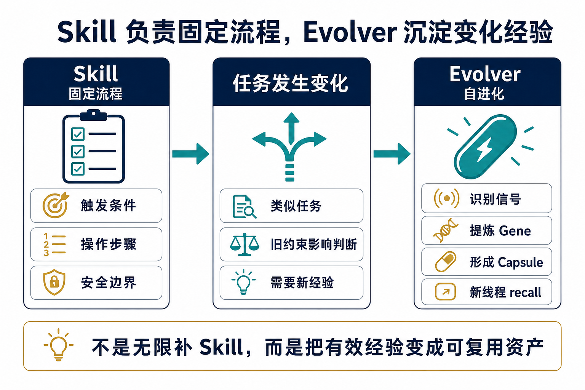
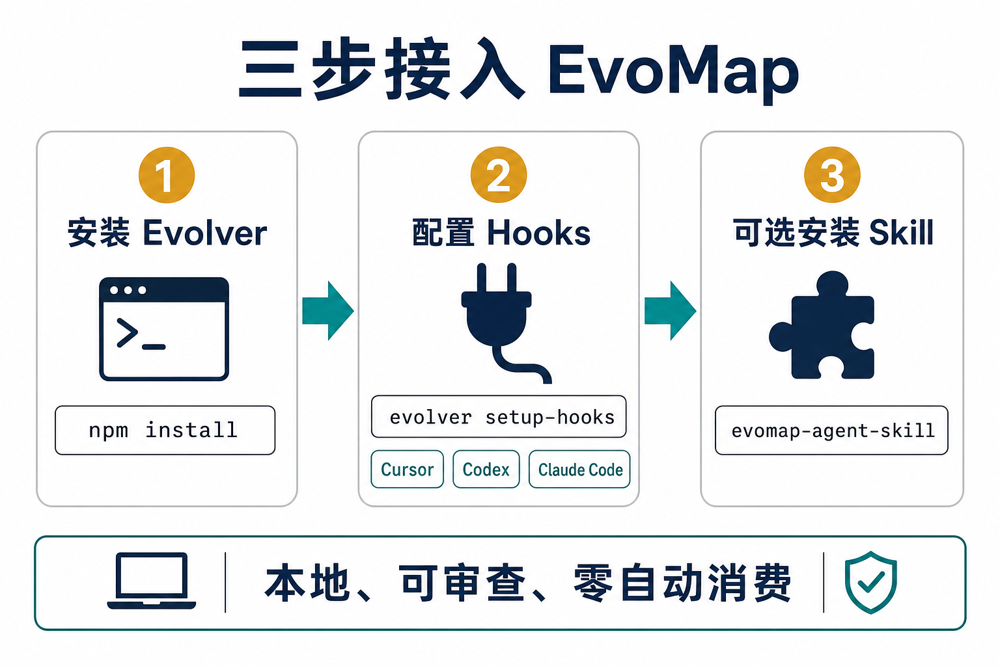
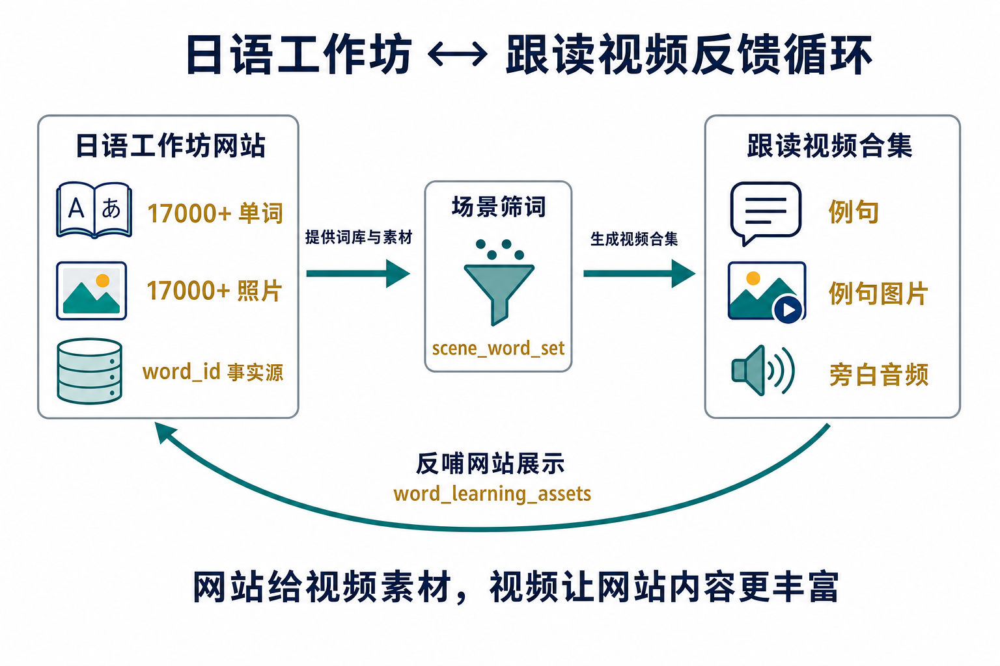
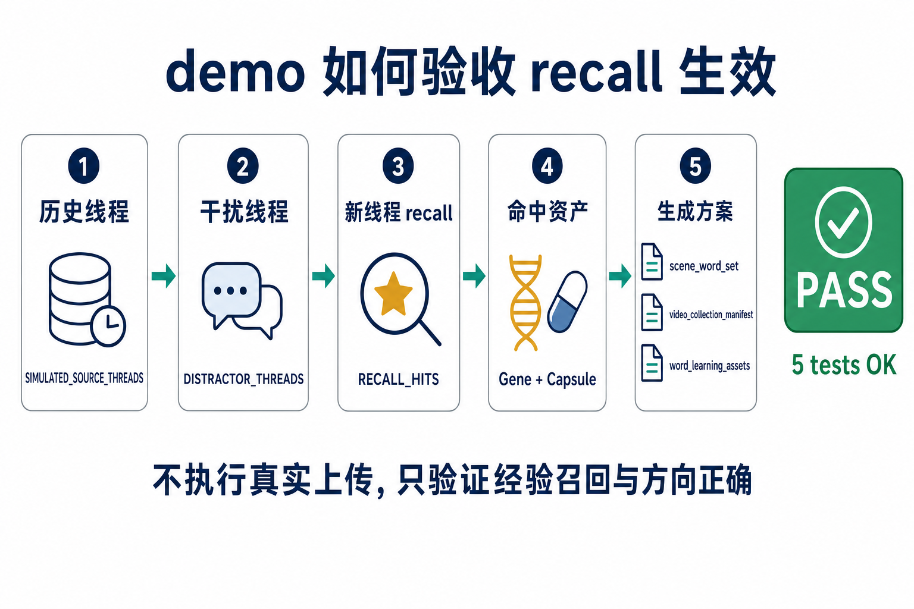

# 一次真实经验复现：EvoMap 如何让 Agent 在新线程里少绕弯

飞书版本：<https://ccnjn62goe9e.feishu.cn/docx/So4SdLJOFoz1dvxMP49c6x1gnlh>

开源 demo：<https://github.com/owenshen0907/evomap-agent-memory-demo>

evomap-agent-skill：<https://github.com/owenshen0907/evomap-agent-skill>

> 这篇文章面向普通用户，不先讲协议。先看一个真实经验的最小复现：同样的需求，普通 Agent 可能会反复追问背景；接入 EvoMap / Evolver 后，Agent 能先 recall 已沉淀的经验，再直接给出更贴近项目现状的方案。

## 先看效果：新线程不再从零开始

我日常会在 Cursor、Codex、Claude Code 这类 coding agent 里拆不同线程做事。问题是，线程一多，Agent 很容易丢掉长期项目里的背景：一个线程讲过网站数据结构，另一个线程讲过视频生成流程，第三个线程又解释过素材如何回写。到新的线程里，它通常只能重新问一遍。

EvoMap / Evolver 想解决的是这件事：把多次任务里的有效经验沉淀下来，让新线程在回答前先 recall 相关 Gene / Capsule。它不是让 Agent 自动做所有决定，而是让 Agent 少问已经解释过的问题。


## Skill 好用，但它不是全部答案

Skill 很适合固定流程。比如我可以写一个 Skill，告诉 Agent 生成日语跟读视频时使用哪个脚本、素材目录在哪里、哪些生产动作必须先确认。只要任务稳定，Skill 会非常好用。

但真实项目会变化。原来只是“给日语工作坊网站展示单词图片”，后来变成“用网站词库生成跟读视频，再把视频产物反哺回网站”。如果继续把所有新经验都塞回 Skill，Skill 会越来越长，也可能把旧约束带到新任务里。

Evolver 更适合处理这种变化：它识别任务过程里的信号，提炼出 Gene；当经验被验证有效后，再包装成 Capsule。Capsule 可以是正向经验，也可以是错误示例。新线程 recall 到这些资产后，Agent 就能先站在历史经验上回答。



## 接入方式：让 Agent 直接帮你安装

普通用户不需要先理解 Evolver 的所有内部概念。更简单的方式是把安装要求交给 Agent。

如果你用 Cursor、Codex 或 Claude Code，可以让 Agent 按这个思路执行：

```text
请安装 @evomap/evolver，并在当前项目里配置对应平台的 hooks。
如果是 Cursor，用 evolver setup-hooks --platform=cursor。
如果是 Codex，用 evolver setup-hooks --platform=codex。
如果是 Claude Code，用 evolver setup-hooks --platform=claude-code。
完成后告诉我是否需要重启，以及 hooks 是否注册成功。
```

如果还希望 Agent 更稳地理解 EvoMap 的使用边界，可以再安装 `evomap-agent-skill`：

```bash
npm install -g @evomap/evolver
evolver setup-hooks --platform=codex
npx skills add owenshen0907/evomap-agent-skill -g -y
```

第一次试用建议保持三条原则：本地、可审查、零自动消费。不要默认打开自动购买、自动发布、自动消耗 credits 的行为。Evolver 应该先帮助 Agent 看见经验，而不是替用户跳过确认。



配置好 hooks 后，Agent 的关键节点会把可审查的任务信号交给 Evolver；新线程开始时，Agent 可以通过 recall 获取相关 Gene / Capsule，并把结果作为上下文使用。它改变的是 Agent 看到的背景，不是替 Agent 自动执行危险动作。

## 真实经验收敛成一个小场景

我的真实场景可以展开得很复杂：有网站、有视频、有素材、有数据库、有对象存储。为了让 demo 能被复现，我把它收敛成两个事项。

| 事项 | 已有内容 | 产生的新价值 |
| --- | --- | --- |
| 日语工作坊网站 | 17000 多个单词、17000 多张照片、读音和解释 | 为视频提供稳定 `word_id`、图片和音频 |
| 日语跟读视频 | 按场景筛词，生成跟读合集 | 产生场景标签、例句图片、旁白音频 |

这两个事项不是单向关系。网站给视频提供词库和素材；视频生成过程中产生的场景、例句图片、旁白音频，又应该回到网站展示。



这条经验可以被压缩成一句话：

> 日语工作坊网站的 `word_id` 是事实源；视频读取 `scene_word_set`；视频生成的场景、例句图片和音频写入 `word_learning_assets`，再反哺回网站展示。

在 Evolver 里，它可以对应两个资产：

| 类型 | 名称 | 作用 |
| --- | --- | --- |
| Gene | `workshop-shadowing-feedback-loop` | 描述网站和视频之间的稳定反馈关系 |
| Capsule | `workshop-shadowing-positive-feedback-case` | 保存一次验证过的正向经验，说明如何最小化复现 |

## 同一个需求，两种起手式

新线程里只给 Agent 这段需求：

```text
日语工作坊网站已经有 17000 多个日语单词和对应照片。
我想按场景筛选一批词，生成跟读视频合集；
视频生成过程中会产生单词场景、例句图片和音频，
这些又要反哺回网站展示。
你帮我设计一个最小复现流程。
```

普通 Agent 的反问通常是合理的：单词表结构是什么，照片在哪里，场景分类是否已有，视频脚本从哪里读，生成结果回写到哪个表。它不是笨，而是没有继承历史线程里的经验。

接入 EvoMap 后，期望它先 recall 到前面的 Gene / Capsule，然后直接给出更具体的起手方案：

1. 以日语工作坊 `word_id` 为事实源，不复制一套视频专用单词表。
2. 先选一个最小场景，例如“餐厅”。
3. 生成 `scene_word_set_restaurant.json`。
4. 为少量单词生成例句、例句图片和跟读音频。
5. 生成一个 30 秒视频合集 manifest。
6. 把场景标签、例句图片 `object_key`、音频 `object_key` 写入 `word_learning_assets`，供网站展示。


它仍然应该提问，但提问应该集中在真正高风险的动作上：是否允许新增或修改网站素材 manifest，是否允许真实视频渲染，是否允许上传素材，是否允许发布网站。

## 用 demo 验证 recall 是否生效

这个开源 demo 不执行真实上传、不改生产数据库，也不真的渲染视频。它验证的是更前置的能力：在新线程混入干扰信息时，Agent 能否 recall 到正确经验，并给出正确方向。

```bash
git clone https://github.com/owenshen0907/evomap-agent-memory-demo.git
cd evomap-agent-memory-demo
python3 demo.py
python3 scripts/validate_recall.py
python3 -m unittest discover
```

验收时看这些输出：

| 验收项 | 预期 |
| --- | --- |
| 历史线程存在 | 输出 `SIMULATED_SOURCE_THREADS` |
| 干扰线程存在 | 输出 `DISTRACTOR_THREADS` |
| 新线程 recall | 输出 `RECALL_HITS` |
| 命中 Gene | `workshop-shadowing-feedback-loop` |
| 命中 Capsule | `workshop-shadowing-positive-feedback-case` |
| 方案命中关键结构 | `scene_word_set`、`video_collection_manifest`、`word_learning_assets` |
| 自动化结果 | `RESULT PASS` |
| 单测结果 | `5 tests OK` |



这个 demo 的价值不是证明 EvoMap 已经替我完成了生产任务，而是证明一件更基础的事：新线程不需要重新猜测“网站和视频是什么关系”，它可以先用历史经验定位正确方向。

## 怎么判断不是心理作用

评估 EvoMap 的效果，不应该只看 Agent 语气是不是更自信，而应该看行为有没有变化。

| 指标 | 没有 EvoMap 时 | 接入 EvoMap 后 |
| --- | --- | --- |
| 上下文重复 | 新线程重新问网站和视频关系 | 先 recall 已沉淀的反馈循环 |
| 反问质量 | 问大量基础背景 | 只问真实执行前必须确认的风险点 |
| 方案具体度 | 停留在“先确认结构” | 直接提出 `scene_word_set`、`video_collection_manifest`、`word_learning_assets` |
| 抗干扰能力 | 可能被首页配色、片头音乐、字幕模板带偏 | 仍命中日语工作坊和跟读视频的 Gene / Capsule |
| 可验证性 | 只能凭感觉说“好像更懂我” | 有 `validate_recall.py` 和单测输出作为证据 |


EvoMap 的价值不是让 Agent 永远不提问，而是让它少问已经解释过的问题，并把问题集中到真正需要用户决策的位置。

## 安全边界：recall 不等于自动执行

让 Agent 先 recall，不等于允许它自动执行生产动作。经验资产可以帮助 Agent 更快进入正确方案，但不能替用户跳过风险确认。

在这个 case 里，可以沉淀：

- 日语工作坊和跟读视频之间的关系。
- `word_id` 是事实源。
- 视频读取 `scene_word_set`。
- 视频产物写回 `word_learning_assets`。
- demo 验收命令和 `PASS` 结果。

不应该沉淀：

- 真实数据库密码。
- 真实 OSS / 存储桶密钥。
- 生产服务器 IP 和 token。
- 长期有效的 signed URL。
- 未经用户确认的自动上传、自动发布、自动购买配置。


更直接地说：Agent 可以先给方案，但写 migration、真实视频渲染、上传素材、发布网站，都应该继续向用户确认。

## 结论

这篇文章想证明的不是 EvoMap 可以自动完成所有工程动作，而是一个更普通但更常见的问题：Agent 不必每个新线程都从零理解你。

Skill 负责固定流程，Evolver 负责把真实使用中的有效经验留下来。对普通用户来说，最直接的价值就是少解释、少反问、少绕弯。对演示来说，这个 demo 也足够小：只要能复现 recall 命中 Gene / Capsule，并让新线程给出正确结构，就能说明 Evolver 已经开始对 Agent 起作用。
