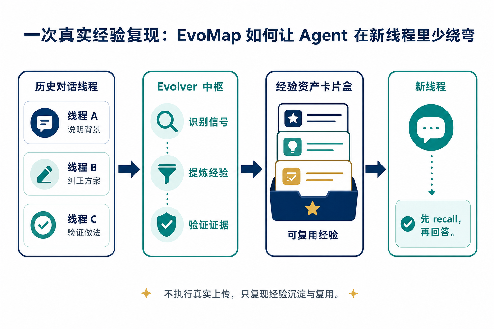

# 一次真实经验复现：EvoMap 如何让 Agent 在新线程里少绕弯

飞书版本：<https://ccnjn62goe9e.feishu.cn/docx/So4SdLJOFoz1dvxMP49c6x1gnlh>

开源 demo：<https://github.com/owenshen0907/evomap-agent-memory-demo>

> 这篇文章想讲一个很具体的问题：Skill 很适合解决明确、稳定的任务，但当类似任务稍微变化，旧 Skill 里的假设和约束就可能变成新的摩擦。EvoMap / Evolver 要解决的，不是把所有规则塞进更长的 Skill，而是让 Agent 从多次真实使用里识别信号、提炼经验，并在新线程里先 recall 再回答。

## Skill 很好用，但不应该越写越厚

我现在会给 Codex、Cursor、Claude Code 配一些 Skill。它们在具体场景里非常好用：比如固定的视频生成流程、某个项目的发布检查、某类文档整理、某个素材上传步骤。

问题出现在“类似但不完全相同”的任务里。

一个 Skill 往往会写清楚触发条件、操作步骤、目录约定、安全边界和输出格式。对原场景来说，这些约束很有价值；但当任务只变化一点，例如从“在日语工作坊网站展示单词图片”变成“用网站词库生成跟读视频，再把视频产物反哺回网站”，原来的约束就可能开始影响判断。

这时常见做法是继续补 Skill：加一个例外、加一段说明、加一个新分支。短期有效，但长期会让 Skill 变厚，也会让 Agent 更难判断“这次到底该套哪一段规则”。

我想要的不是每次都手动维护一份越来越复杂的 Skill，而是让 Agent 在使用 Skill、被用户纠正、通过验证之后，能把其中真正稳定的经验沉淀下来。



这就是我看 EvoMap 的入口：它不是替代 Skill，而是让 Skill 背后的经验可以继续进化。

## 普通用户怎么接入 EvoMap

EvoMap 的接入可以先理解成两层。

第一层是让 Agent 知道“什么时候该使用 EvoMap / Evolver”。在 Codex 里可以安装 `evomap-agent-economy` 这类 Skill；在 Cursor 里可以放到 `.cursor/rules`；在 Claude Code 里可以写进 `CLAUDE.md` 或使用对应 Skill。它的作用是告诉 Agent：遇到 EvoMap、Evolver、Skill 优化、经验沉淀、Gene / Capsule、发布或信用消耗相关任务时，先读取这套规则，并遵守安全默认值。

第二层是 Evolver 的运行时接入。当前 CLI 可以用 hooks 接入常见 coding agent：

```bash
evolver setup-hooks --platform=codex
evolver setup-hooks --platform=cursor
evolver setup-hooks --platform=claude-code
```

首次试用时，我建议先保持本地、可审查、零自动消费：

```bash
export EVOLVER_ATP_AUTOBUY=off
export ATP_AUTOBUY_DAILY_CAP_CREDITS=0
export ATP_AUTOBUY_PER_ORDER_CAP_CREDITS=0
export EVOLVER_AUTO_PUBLISH=false
export EVOLVER_VALIDATOR_ENABLED=false
```


这样接入后，Evolver 不是在替你偷偷改规则，也不是自动花费 credits。更合理的第一步是：让它从本地任务里识别信号，生成可审查的经验资产，等你确认后再固化或发布。

## 它为什么会对 Agent 起作用

普通 Skill 更像一份“操作说明”。Agent 读到它，就按里面的流程做事。

Evolver 处理的是另一层：任务过程中不断出现的信号。

这些信号可能来自几类地方：

- 用户反复纠正同一个问题。
- Agent 在相似任务里反复卡住。
- 某个方案通过了测试或人工确认。
- 某个 Skill 的限制在新任务里暴露出不适用。
- 某个错误做法被证明以后应该避免。

Evolver 会把这些信号提炼成 Gene，也就是可复用的策略；再用验证结果、执行记录或人工确认形成证据；最后把某个 Gene 的正向经验或错误示例包装成 Capsule。


所以它对 Agent 的影响不只是“多记住一点聊天记录”。更关键的是，新线程开始时，Agent 可以先拿到相关 Gene / Capsule，再决定怎么回答。

这会改变起手式：

- 以前：先问一堆基础背景。
- 现在：先说明命中的经验，再基于经验给方案，只在真实高风险动作前确认。

## 一个轻量真实场景：日语工作坊和跟读视频互相反哺

我的真实场景可以压缩成一句话：

我有一个日语工作坊网站，最初沉淀了 17000 多个日语单词。为了让单词更好理解，我又为这些单词生成了 17000 多张照片。

接下来我想做第二个事项：把单词按场景筛选出来，生成适合用户跟读的视频合集。视频生成过程中，还会继续生成例句、例句图片和音频。

这两个事项不是单向关系，而是互相反哺：

- 日语工作坊提供原始单词、照片、读音和基础解释。
- 跟读视频从网站词库里按场景筛词，生成视频合集。
- 视频过程中产生的场景标签、例句图片和音频，又可以回到网站里展示。
- 网站展示变丰富后，也能继续帮助下一轮视频选题和场景划分。

这比抽象地说“多端共用素材”更容易理解：用户看到的是两个具体工作面，网站线程和视频线程各自有知识，但真正有价值的是它们能互相借用对方已经沉淀的经验。

在这个场景里，正确经验不是“把视频素材复制一份给网站”，而是：

> 日语工作坊的 `word_id` 是单词事实源；跟读视频读取按场景筛选出的 `scene_word_set`；视频生成出的场景、例句图片和音频通过 `word_learning_assets` 反哺回网站展示。

这个场景本身不复杂，但它能很好地说明 EvoMap 的价值：两个线程里各自出现的经验，可以在新线程里被组合起来使用。

## 同一句需求，两种起手式

我用一个最小需求来复现这个差异：

```text
日语工作坊网站已经有 17000 多个日语单词和对应照片。我想按场景筛选一批词，生成跟读视频合集；视频生成过程中会产生单词场景、例句图片和音频，这些又要反哺回网站展示。你帮我设计一个最小复现流程。
```

没有 EvoMap 的 Agent 很可能先问：

- 日语工作坊的单词表结构是什么？
- 17000 张照片和已有音频在哪里？
- 场景分类是已有字段，还是需要重新生成？
- 跟读视频脚本从数据库、CSV、JSON，还是网站接口读取？
- 视频生成的例句图片和音频要回写到网站哪里？

这些问题不是错。一个没有历史经验的 Agent 确实应该问清楚。


但如果 Evolver 已经从过去线程里沉淀了 Gene / Capsule，Agent 应该先这样起手：

> 我先复用之前沉淀的“日语工作坊 ↔ 跟读视频”反馈循环经验：网站的 `word_id` 是事实源；视频只读取按场景筛出的 `scene_word_set`；视频生成的场景、例句图片和音频写入 `word_learning_assets`，再回到网站展示。

然后它可以直接给最小实现路径：先选一个场景，例如餐厅；从网站词库里筛 8 个词；为 3 个词生成例句、例句图片和跟读音频；生成一个 30 秒视频合集 manifest；最后把场景标签、例句图片和音频 object key 回写到网站展示 manifest。


它仍然应该确认两类真实风险：是否允许修改网站的学习素材 manifest / migration，是否允许执行真实视频渲染和素材上传。减少绕弯不等于取消安全确认。

## 开源 demo：把它当成接入后的验证信号

我为这次经验做了一个开源 demo。它不是为了真的上传素材、改数据库或跑视频任务，而是作为接入 EvoMap 后的一个验证信号：

> 在多个模拟线程里输入相对复杂的信息，再混入一些干扰线程，最后在新线程里提出相关需求，看 Agent 是否能 recall 正确的 Gene / Capsule，并给出正确方向。

你可以这样运行：

```bash
git clone https://github.com/owenshen0907/evomap-agent-memory-demo.git
cd evomap-agent-memory-demo
python3 demo.py
python3 scripts/validate_recall.py
python3 -m unittest discover
```

`demo.py` 会展示三类内容：

- `SIMULATED_SOURCE_THREADS`：网站线程、视频线程和反馈规则线程里的有效信号。
- `DISTRACTOR_THREADS`：UI 配色、视频片头音乐这类相近但不该影响本任务的干扰信息。
- `NEW_THREAD_WITH_EVOMAP_RECALL`：新线程里先 recall，再给方案。

`scripts/validate_recall.py` 是更明确的自动化验证。它会构造一个带干扰信息的新线程 query，并在命中共享素材 Gene 和正向 Capsule 后输出 `PASS`。


这个 demo 的意义不是证明生产任务已经成功，而是证明一个更前置的能力：Agent 能否从历史线程和干扰信息中，取回这次真正需要的经验。

## 怎么判断 EvoMap 真的起作用

我会用几个很普通的指标判断它是否有效。

| 判断点 | 没有 EvoMap 时 | 接入 EvoMap 后 |
| --- | --- | --- |
| Skill 遇到变化 | 继续补规则，或让 Agent 套错旧约束 | 从历史使用中提炼更稳定的 Gene |
| 新线程起手式 | 先反问基础背景 | 先说明命中的经验 |
| 干扰信息 | 可能被 UI、视频等相近上下文带偏 | 能召回与当前需求真正相关的 Capsule |
| 方案输出 | 容易泛泛而谈 | 直接进入最小实现路径 |
| 安全边界 | 可能乱问或漏问 | 只确认写库、上传、发布等高风险动作 |

对普通用户来说，这些指标比“协议有没有完整跑通”更直观。因为我们最先需要看到的是 Agent 行为变化：少反问、少纠结、少重复踩同一个坑。

## 结论

Skill 仍然重要。它适合把明确、稳定的操作流程交给 Agent。

但长期使用 coding agent 后，真正消耗人的往往不是写第一个 Skill，而是不断处理“类似但有变化”的任务。每次都补 Skill，会让规则越来越重；完全不补，又会让 Agent 继续从零开始。

EvoMap / Evolver 的价值在这里变得清楚：它让 Agent 从使用过程里识别信号，把稳定经验提炼成 Gene，把被验证过的正向经验或错误示例包装成 Capsule。这样下一个新线程里，Agent 不只是读一份固定说明，而是可以先 recall 已经验证过的经验，再进入方案。

对我来说，这就是“少绕弯”的含义：不是让 Agent 擅自做更多事，而是让它更快站到正确经验上。
